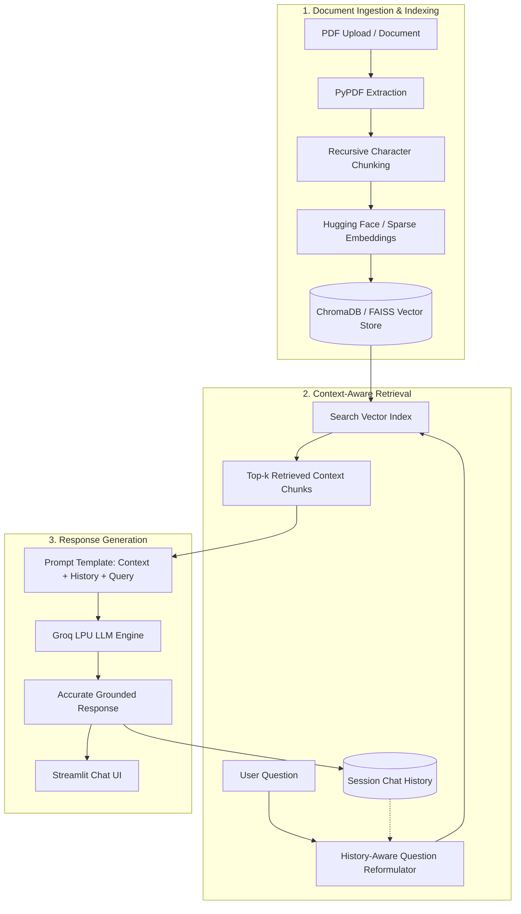

# 📖 Conversational RAG with PDF & Chat History 🚀

[](https://www.python.org/)
[](https://streamlit.io/)
[](https://www.langchain.com/)
[](https://groq.com/)
[](#-evaluation-benchmark--accuracy-validation)
[](#-evaluation-benchmark--accuracy-validation)

A state-of-the-art **Conversational RAG (Retrieval-Augmented Generation)** application that enables users to upload PDF documents, engage in multi-turn conversations with an AI assistant, and retrieve accurate, context-grounded responses with session-based memory.

Powered by **Groq's Ultra-Fast LPU Inference**, **LangChain**, **ChromaDB / FAISS**, and **HuggingFace Embeddings**.

---

## 🏗️ Architecture & Workflow



---

## ✨ Features

- 📄 **Multi-PDF Processing** — Extract and split text from multi-page documents seamlessly.
- 🧠 **Context-Aware Conversational Memory** — Dynamically reformulates questions based on chat history to handle pronouns, follow-ups, and multi-turn dialogues.
- ⚡ **Groq Ultra-Fast Inference** — Leverages Groq hardware for sub-second, low-latency LLM generations.
- 🔍 **Vector Search with ChromaDB & FAISS** — Efficient similarity search to pull the most pertinent document chunks into context.
- 🧪 **Built-In Accuracy & Retrieval Benchmark** — Includes a rigorous 20 question-answer test suite over a sample PDF with automated metrics (Hit Rate @ $k$, MRR, Token F1, Concept Recall, Accuracy).
- 🖥️ **Interactive Streamlit Interface** — Clean, responsive web UI for managing sessions and chatting in real time.

---

## 🛠️ Installation & Setup

### 1️⃣ Clone the Repository
```bash
git clone https://github.com/payalt2006/Conversational-RAG.git
cd Conversational-RAG
```

### 2️⃣ Create & Activate a Virtual Environment
```bash
# On macOS / Linux
python -m venv venv
source venv/bin/activate

# On Windows (Command Prompt / PowerShell)
python -m venv venv
venv\Scripts\activate
```

### 3️⃣ Install Dependencies
```bash
pip install -r requirements.txt
```

### 4️⃣ Set Up Environment Variables
Copy the example environment file and add your credentials:
```bash
cp .env.example .env
# On Windows PowerShell:
Copy-Item .env.example .env
```
Then configure your keys inside `.env`:
```ini
GROQ_API_KEY="your-groq-api-key"
HF_TOKEN="your-huggingface-token"
```

> **Tip:** You can obtain a free, high-speed API key from the [Groq Console](https://console.groq.com/).

### 5️⃣ Launch the Streamlit App
```bash
streamlit run app.py
```
Open your browser at `http://localhost:8501` to start chatting with your documents!

---

## 🧪 Evaluation Benchmark & Accuracy Validation

To ensure your RAG chatbot reliably retrieves relevant passages and generates factually correct answers, this repository includes an end-to-end evaluation suite (`evaluate_rag.py` / `eval.py`) with **20 ground-truth QA pairs** over the included sample paper ([`temp.pdf`](./temp.pdf): *"A Comprehensive Overview of Large Language Models"*).

### How to Run the Benchmark

```bash
# 1. Run local offline evaluation (Instant, zero API key required)
python evaluate_rag.py

# 2. Run live evaluation with Groq LLM generation and scoring
python evaluate_rag.py --groq_api_key "your-groq-api-key"

# 3. Use the convenience alias with custom options
python eval.py --pdf ./temp.pdf --top_k 3 --output eval_results.json --report eval_report.md
```

### 📊 Benchmark Results

| Metric | Offline Extractive Baseline | Live Groq (`qwen/qwen3.8-27b`) | Target |
| :--- | :---: | :---: | :---: |
| **Top-1 Retrieval Hit Rate** | `95.0%` | **`95.0%`** (19/20) | > 80% |
| **Top-3 Retrieval Hit Rate** | `100.0%` | **`100.0%`** (20/20) | > 90% |
| **Mean Reciprocal Rank (MRR)** | `0.9667` | **`0.9667`** | > 0.85 |
| **Average Token F1 Score** | `0.3534` | **`0.6800`** | > 0.40 |
| **Key Concept / Fact Recall** | `49.25%` | **`79.17%`** | > 75% |
| **Overall Answer Accuracy** | `55.0%` | **`90.0%`** (18/20) | > 85% |

### Evaluated Metrics Explained
- **Hit Rate @ $k$ (Top-1 / Top-3)**: Percentage of queries where relevant document chunks are successfully retrieved in the top-$k$ results.
- **Mean Reciprocal Rank (MRR)**: Measures retrieval precision and ranking quality ($1/\text{rank of first hit}$).
- **Token-Level F1 Score**: Harmonic mean of precision and recall between generated and reference answers.
- **Key Concept Recall**: Proportion of essential ground-truth entities and facts captured in the response.
- **Automated Outputs**: Automatically writes machine-readable [`eval_results.json`](./eval_results.json) and Markdown summary [`eval_report.md`](./eval_report.md).

---

## 📁 Project Structure

```bash
📂 Conversational-RAG
│-- 📜 app.py                  # Main Streamlit conversational RAG application
│-- 📜 app_1.py                # Alternate Streamlit document Q&A application
│-- 📜 evaluate_rag.py         # Full evaluation benchmark & accuracy validation script
│-- 📜 eval.py                 # Convenience alias for evaluate_rag.py
│-- 📜 eval_qa_pairs.json      # 20 Curated ground-truth QA pairs over sample PDF
│-- 📜 eval_report.md          # Generated benchmark Markdown report
│-- 📜 eval_results.json       # Generated benchmark JSON metrics artifact
│-- 📜 requirements.txt        # Python package dependencies
│-- 📜 .env.example            # Environment configuration template (git-tracked)
│-- 📜 .env                    # Local environment variables (API keys - gitignored)
│-- 📜 .gitignore              # Files and directories ignored by Git
│-- 📜 README.md               # Project documentation
│-- 📂 chroma_db               # Persisted vector database (generated at runtime)
│-- 📂 temp.pdf                # Sample / uploaded research paper for RAG and evals
```

---

## 🎯 How to Use the Web Application

1. **Enter API Key**: Provide your Groq API key in the Streamlit sidebar/input field.
2. **Set Session ID**: Organize different chat sessions using custom Session IDs.
3. **Upload PDFs**: Drop one or more PDF files via the file uploader.
4. **Ask Questions**: Type your prompt. The history-aware retriever reformulates your query, finds the relevant context, and streams the answer.
5. **Inspect History**: View stored chat history to trace conversational continuity across queries.

---

## 📦 Core Dependencies

| Package | Purpose |
| :--- | :--- |
| `streamlit` | Interactive web user interface |
| `langchain` / `langchain-core` | RAG chains, prompt templates, and runnable composition |
| `langchain-groq` / `groq` | Ultra-fast Groq LPU LLM inference |
| `langchain-chroma` / `chromadb` | Vector database for storing and querying chunk embeddings |
| `langchain-huggingface` | Hugging Face embedding models (e.g. `all-MiniLM-L6-v2`) |
| `faiss-cpu` | High-performance similarity search |
| `pypdf` | PDF document parsing and text extraction |
| `scikit-learn` | Sparse matrix TF-IDF vectorization and evaluation metrics |
| `python-dotenv` | Automatic environment variable loading from `.env` |

---

## 🤝 Contributing

Contributions, issues, and feature requests are welcome! Feel free to open an issue or submit a Pull Request.

1. Fork the Project
2. Create your Feature Branch (`git checkout -b feature/AmazingFeature`)
3. Commit your Changes (`git commit -m 'Add some AmazingFeature'`)
4. Push to the Branch (`git push origin feature/AmazingFeature`)
5. Open a Pull Request

---

## 📄 License

This project is open-source and available under the [MIT License](LICENSE).
